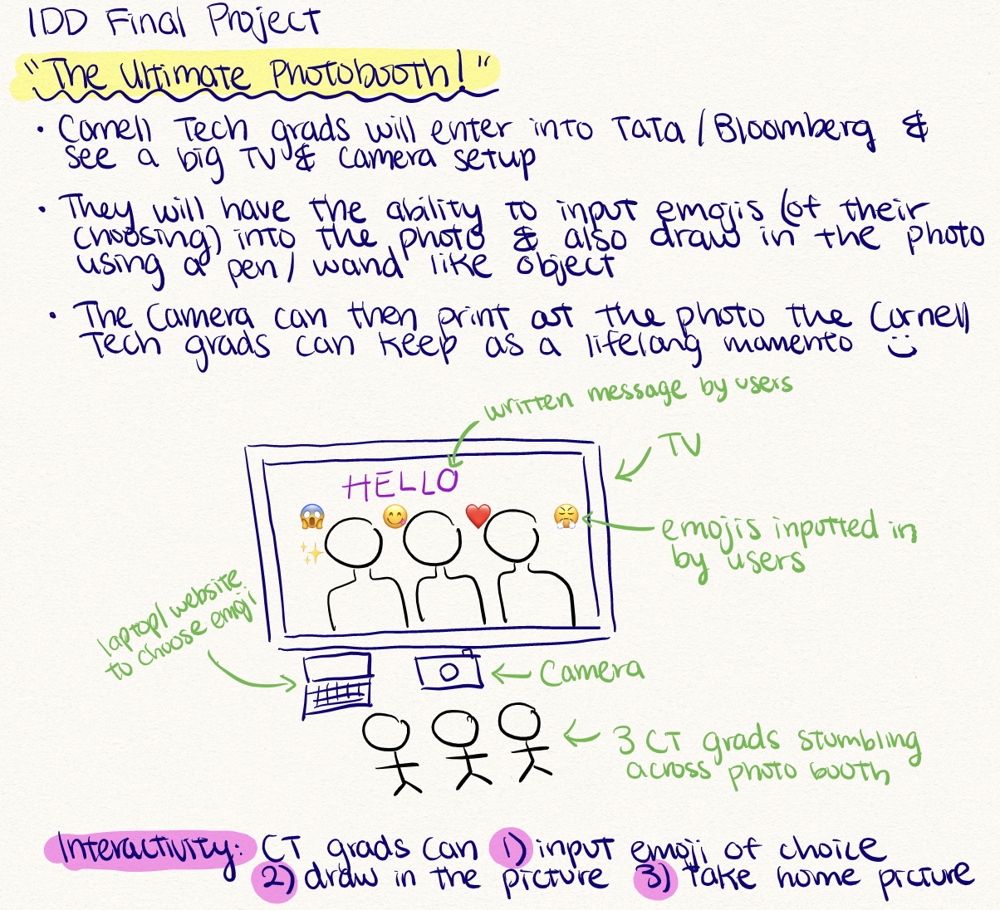
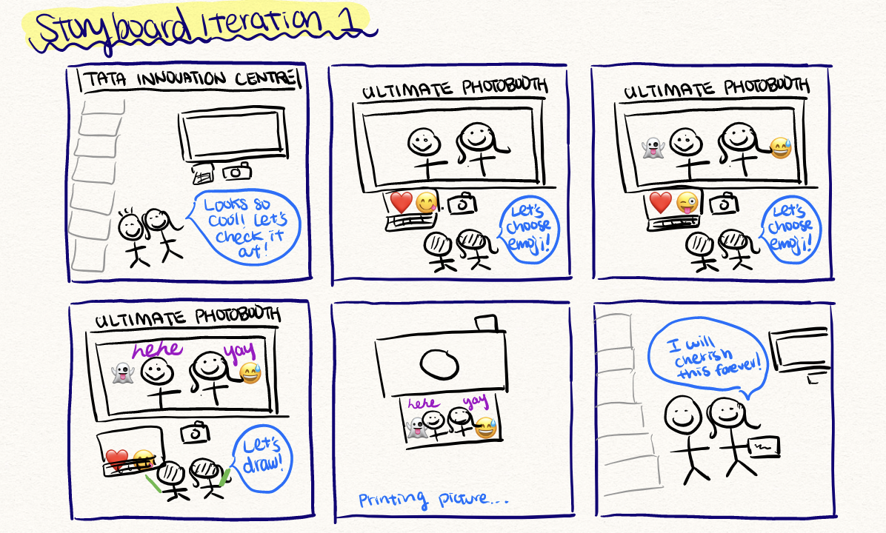
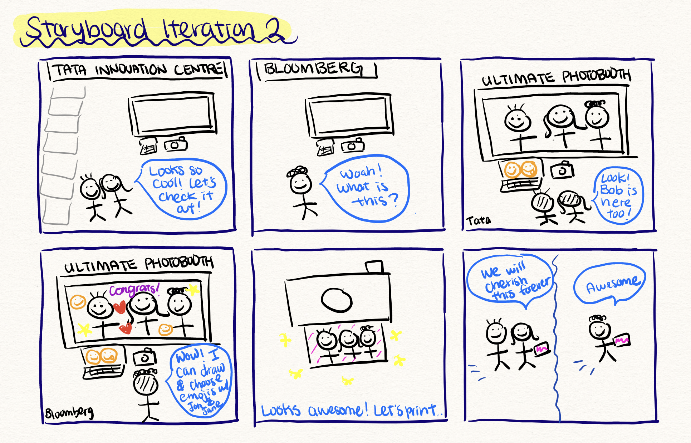
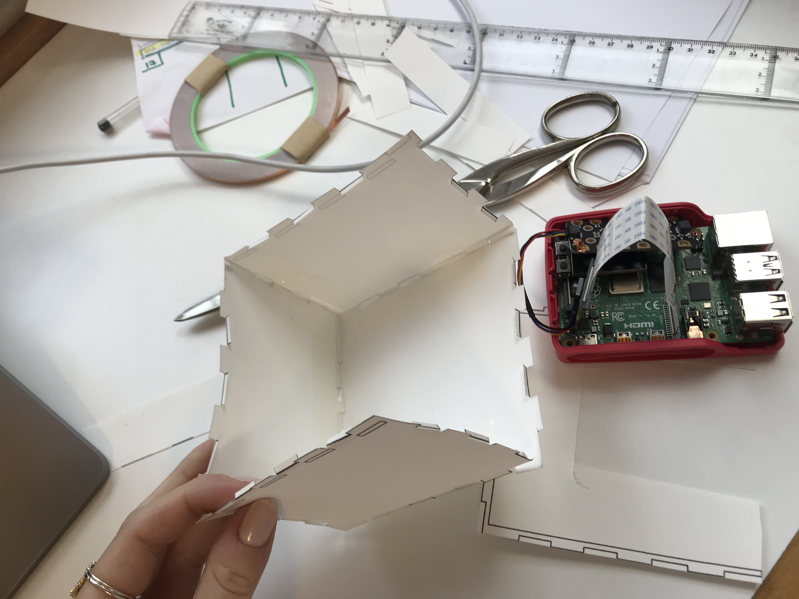
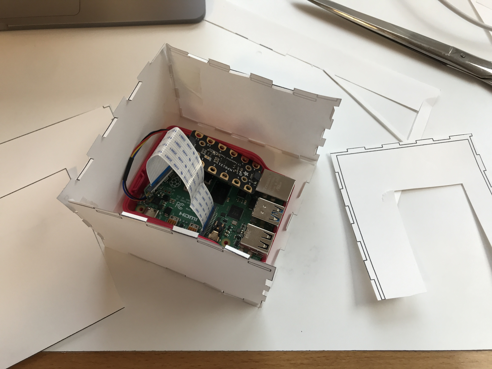
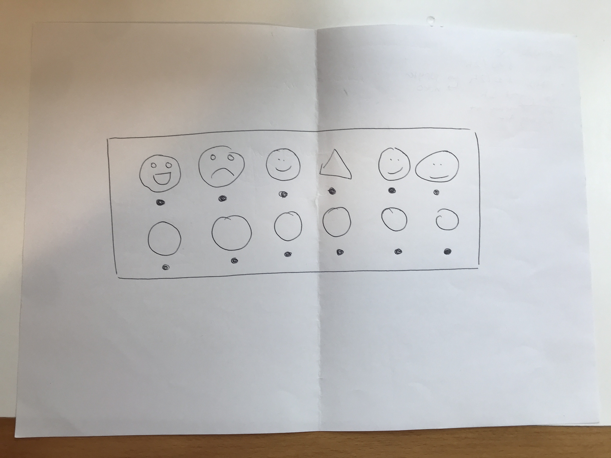

# [Final Project for IDD Spring 2021](https://github.com/FAR-Lab/Interactive-Lab-Hub/tree/Spring2021/Final%20Project)

# CollaBoard, a collaborative drawing and emoji board! 📷 🖌

by Hortense Gimonet, Irene Font Peradejordi, Brandt Beckerman, Rui Maki

- [What It Is](#what-it-is)
- [How to Use It](#how-to-use-it)
- [How To Make It](#how-to-make-it)
- [Design Process](#design-process)


## What It Is

This is a collaborative drawing board. You can leave graduation messages for your peers at CT!
There are multiple boards around campus, and all of them are connected. Editing on one is editing them all!

Our aim was to create fun, interactive, and distributed photo booth stations for Cornell Tech grads. When these grads come across one of these photobooths (located in stations across campus like Tata, Bloomberg, Cafe, etc.), they will see a large TV mounted to a wall that is capturing their faces and movements through the raspberry pi camera. They will then be able to interact with the camera by placing emojis of their choice onto the photo and write messages on the
photo. Other people who are also using the photo booth at other stations can also edit the photo through emojis and drawings. 

### Impact and Applications

We hope this interactive photo booth can serve as a fun way to bring people together who are located at different locations. While we created the Collaboard for the purposes of having a fun graduation activity for CT grads, it can also be used for:
1. Remote learning over zoom when multiple people need to collaborate on a photo or drawing at the same time (like Google docs but for images)
2. Connecting long distance friends, couples, families through a fun creative project 
3. Graphic designers, UX Designers, Photographers etc. to collaborate on a work assignment remotely
4. The basis of a smartphone app game like "Draw Something"
5. The new "Snapchat," a social media platform where users can send images that they can edit together 

[](http://www.youtube.com/watch?v=R66CZs_p3Es "CollaBoard Demo")

## How to Use It

To get started, grab the **writing tool** (a green piece of chalk or highlighter). This is what you will use to interact
with the Board!

### Eraser Mode

To clear the entire board press 'e' on a laptop, or the eraser on the box.

### Drawing Mode

In drawing mode, the tool will leave a trace wherever it is detected. To have a break between lines or when writing
letters, hide the pen behind your hand and show it again to resume painting.

### Emojis Mode

Hold the green pen in place for 3 seconds to place an emoji. A countdown to 3 seconds will start whenever the pen is
detected in emoji mode. You can also hide the pen in your hand if you are still thinking about where to place the emoji.

To switch between emojis, press the capacitive buttons on the pi box, or press 'p' on a laptop.

## How To Make It

Each Pi must be equipped with a camera, a capacitive touch board, and connected to a screen. A box to contain the Pi can
be laser cut out of cardboard or wood. You will also need conductive wire or tape to connect the capacitive sensors to
the correct buttons on the box.

### Materials

For this project, you will need:

- A [Raspberry Pi](https://www.adafruit.com/product/)
- A 12-button [Capacitive Touch Sensor Breakout](https://www.adafruit.com/product/4830)
- A Raspberry Pi Camera
- A screen connected to the pi
- Thin wood or cardboard
- Conductive wires or copper/aluminium tape
- A single bright-colored object to be detected by the camera
- A laser-cutter, or a box cutter, ruler, and pencil

### Code

#### Running and Requirements

The only python required to run CollaBoard
is [CollaBoard/emoji_node_mqtt.py](https://github.com/hgimonet/IDD_spring2021_Final_SayCheese/blob/main/CollaBoard/emoji_node_mqtt.py)
. You will also need the  emoji image files
in [CollaBoard/emojis](https://github.com/hgimonet/IDD_spring2021_Final_SayCheese/tree/main/CollaBoard/emojis)

Each computer running the code must be equipped with a camera or webcam.

To run the code on the pi, you must be on the GUI. Do access the pi with the GUI, you can VNC in. Once in
the `CollaBoard` folder, you can start the program with the following command:

```
python emoji_node_mqtt.py
```

#### Technical Details

CollaBoard consists of Pis or computers all listening to each other through mqtt. 
Each node is retrieving frames from its camera, and performing basic computer vision techniques to allow the user to add emojis or dots of color to a shared canvas (which is superimposed onto the captured frames.) 
When the user wishes to add something to the board, a message is sent to every computer node on the CollaBoard network, and every node prints the addition onto their respective screen.

The interactive aspect of the board is achieved using basic color thresholding and contouring on the frames taken by a Raspberry Pi Camera or computer webcam.
The node loops over every frame supplied by the camera at a given interval.
First, the camera frame is thresholded to detect the drawing pen color (we have used green and yellow highlighter caps). 
Then, we applied contouring on the thresholded image. In order to define a good range to detect the pen object, you can start with a similar web color, and broaden or move the range through trial and error. 
It is best to do this in the location at a similar time of day you will be setting up the camera node, as the color ranges will vary by lighting. 

If an instance was detected, we then wait for the frame equivalent of 3 seconds before sending a message via mqtt containing an index corresponding to either an emoji or a dot of color, as well as the x,y coordinates of the upper left corner of the contour bounding box.
The object to be superposed is determined by a state variable that can be changed either through pressing the buttons connected to the capacitor sensor, or toggled through by pressing the p key on a non-pi computer.

Then, at the end of the loop, all messages are processed and turned into emojis and circles of color to be plotted onto the captured image frame.

To avoid overloading the screen, we capped the number emojis and dots on the screen at a time to 12 emojis and 1500 dots. 
When those caps are reached, the oldest emojis or dots are forgotten. 
This insures the board is never too crowded, even if many people are interacting with it as a time.

### Making the Box

The files required to laser cut and engrave the box are
in [CollaBoard/Box_files](https://github.com/hgimonet/IDD_spring2021_Final_SayCheese/tree/main/CollaBoard/Box_files).
They were based on
this [box](https://3axis.co/laser-cut-wooden-box-with-sliding-lid-15x15x10-3mm-mdf-template-dxf-file/075yjn3o/).

To cut and assemble the box, follow [this tutorial]().

### Assembly

1. After putting all but the last faces of the box together, securely place the Pi inside.
2. Place the camera in the camera hole
3. Connect the emojis engravings to the capacitive sensor board with the wire or tape by passing it through the holes
   beneath the engraved emojis. The number lineup is the following:

| Number | Emoji |
|--------|-----------|
| 0 | Paintbrush Mode |
| 1 | grinning-face :grinning: |
| 2 | partying-face :partying_face:|
| 3 | shamrock :shamrock: |
| 4 | red-heart :hearts: |
| 5 | waving-hand :wave: |
| 6 | globe :earth_americas: |
| 7 | graduation-cap 🎓 |
| 8 | bottle-with-popping-cork :champagne: |
| 9 | balloon    :balloon: |
| 10 | light-bulb :bulb: |
| 11 | Eraser mode |


## Design Process

We iterated through multiple designs.

### Ideas and Storyboard

Below highlights the initial ideas we had for our ultimate photobooth idea for CT grads: 


We then crafted our first Storyboard showcasing how a user would interact with the photobooth at a single station: 


This second storyboard showcases the distributed and collaborative nature of the Collaboard:



### Design 1: Distance Group Pictures

The aim of this device is to capture a group picture of people who are at different places in the world, in a city, or
in a room (depending on how many stations of this device we set up). When a user approaches a device station (perhaps
they are curious to see what the device is), they will be instructed to pose in a fun way. When the other device
stations that are set up have also been filled up by people, the camera will take a picture of each person’s pose and
compile it into one group photo that will be printed at each camera station (like a polaroid). Due to potential privacy
concerns, the camera will only be taking the silhouette of each person’s pose and fill it in with a fun emoji of the
user’s choice. After the photo is taken, the user can then choose to either keep the photo or to discard it in a
waste/mini paper shredder bin placed next to the camera booth.

### Design 2: Towards Collaborative Art

One issue we struggled with in design 1 was privacy concerns. We wanted the camera to take pictures automatically, but
it seemed high-handed to do so in a public space without prior authorization. We played with several ideas to obscure
people's identifying features, but all of the solutions we considered (sihouetting figures, or face contouring) were
computationally demanding and difficult to code. This pushed us to consider other methods of expression: why not let
people write and leave emojis? We gave up on the idea of saving pictures, and focused on creating an interactive
messaging/artboard experience instead.

#### Paper prototype

We started small, prototyping the box using paper. Some important considerations we thought of were (1) the size – the box should be small enough to be portable and stand in a wide range of surfaces but big enough to fit a raspberry pi with the camera and the capacity sensor attached to it – (2) the user interaction – buttons or haptic inputs seem the most user friendly way to interact with the box and chose from the different modes. We ultimately chose haptic inputs over buttons because buttons would require a bigger surface – (3) communicating the instructions to the user – the interaction has 2 different modes: drawing and emoji, and inside the emoji mode, the user can choose from a different range of options. It was important to communicate this hierarchy with the design we ended up etching a face of the box. 

<p float="left">
    
    
    
</p>

#### Cardboard prototype

We then used the lasercutter to create the cardboard prototype. Using the 40 watt laser cutter at 70 speed, 90 power for engraving and 20 speed, 45 power for cutting, we were able to create a cardboard prototype of the paper version displayed above. This prototype was created to test the laser cutting settings and visualize what the final design would look like when we use wood. 

<p float="left">
    
    
    
</p>

#### Wood prototype

We then used the saw and laser cutter to cut a piece of MDF wood (0.25 inch) to create our final wood prototype. Using the suggested 30 speed and 100 power settings, we hoped to be able to build our wood prototype. However, even after 5 iterations of using the laser cutter at maximum power, we were not able to fully cut through the wood to build our final wood prototype. Thus, for the purposes of this project, we decided to stick to a cardboard prototype since the structure was fairly stable and the etching of the design came out clear. 

<p float="left">
    
    
</p>

